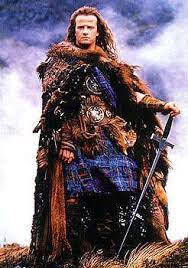

```{r setup, include=FALSE}
options(htmltools.dir.version = FALSE, htmltools.preserve.raw = FALSE)

knitr::opts_chunk$set(warning = FALSE, message = FALSE)
```


```{r xaringan, echo=FALSE}
xaringanExtra::use_xaringan_extra(c("tile_view","panelset","tachyons","scribble"))
```

```{css echo = FALSE}
.xe-scribble__tools.minimized {
  display: none;
}
```

# Xaringan presentation

## What is Xaringan?

- [`Xaringan`](https://github.com/yihui/xaringan) is an R package that can be used to create slides

- The name comes from Sharingan from the anime Naruto! `r emoji::emoji("laugh")`

- How to install:

```{r eval=FALSE, include=TRUE}
devtools::install_github('yihui/xaringan')
```

- How to get started:

    - [Xaringan github](https://github.com/yihui/xaringan)

---
# Xaringan presentation

- Here are some great tutorials:

  - [Xaringan github](https://github.com/yihui/xaringan)

  - [Yihui's tutorial](https://slides.yihui.org/xaringan/#1)
  
  - [Making Slides in the Tada!-verse](https://apreshill.github.io/data-vis-labs-2018/slides/06-slides_xaringan.html#1)
  
  - [Making slides in R Markdown](http://arm.rbind.io/slides/xaringan.html#1)

- Some useful extensions for `Xaringan`

  - [`xaringanExtra` R package](https://github.com/gadenbuie/xaringanExtra)
  
  - [`xaringanthemer` R packge](https://pkg.garrickadenbuie.com/xaringanthemer/index.html)
  
  - [Xaringan Gallery](https://xaringan.gallery/)
  
  - [`DT` R package for interactive tables](https://rstudio.github.io/DT/)


---
# Shoutout to Tuo Wang and Joseph Casillas

Their awesome work on designing UW-Madison and Rutgers Xaringan presentations laid most of the groundwork and conceptually idea for a UCSB specific theme!

[Check out Tuo's UW](https://ttuowang.github.io/Xaringan-wisconsin-theme/#1)

[And Joseph's Rutgers](https://www.jvcasillas.com/ru_xaringan/slides/index.html#1)

And of course to  for developing Xaringan all the other amazing features of Rmarkdown as well!

---

# UCSB theme

- How to enable the UCSB theme: Need to replace placeholders

```md
output:
  xaringan::moon_reader:
    lib_dir: libs
    css: ["ucsb.css", "fonts"]
```

- Note: Right now it would best to fork in my github and load the css, but I hope to get it within the official `xaringan` options

- The UCSB theme for `Xaringan` works best with a 16:9 aspect ratio

```md
nature:
  highlightStyle: github
  highlightLines: true
  countIncrementalSlides: false
  ratio: "16:9"
```
---

# Choosing Fonts

- Eventually settle on one group of consistent fonts with `ucsb-fonts.css` to throw in the `YAML`

  - For now experiment with different font css files

- Can manually define fonts with `xaringanthemer`

- Make a code chunk after setting code options

```{r fonts, eval=FALSE,echo=TRUE}
xaringanthemer::style_xaringan(text_font_google = google_font("Poppins"),
                               header_font_google = google("Montserrat"))
```


---
class: inverse, middle, center

# Styling in UCSB Xaringan

---

class: title-slide-section-blue, middle, center

# Alternate style

---

class: title-slide-section-gold, middle, center

# One more for the Gaucho Gold

---

# Define styles through the class definition

At the beginning of each new slide break define the "class of slide to be used"
``` css
class: inverse, middle, center
```
`inverse` is the complete opposite of the default style. Uses the black background with white text.

`middle`  where to put the headers vertically

`center` where to put headers in a horizontal orientation

---

class: title-slide-section-blue

# Change the color palette with a new section

## Different headers

- How does the text look

- Use .bold[Bold to make stuff pop]

---

class: title-slide-section-gold

# I made three verisons of alternate backdrops

## Access them with `class: title-slide-section-color` at beginning

- For example this slide uses `class: title-slide-setion-gold`

- The blue preceding slide uses `class: title-slide-section-blue`

- Black inverse is just `class: inverse`

---
# UCSB text styles

- We can make `blockquotes` by calling `<uc-blockquote>some texts</uc-blockquote>`

<uc-blockquote>This is a blocked quote</uc-blockquote> 

- Highlight text using `**text**` like **this**

- Italic text using `*text*` like *this*

- Bold text using `.bold[text]` like .bold[this]

---
# UCSB text colors

- We can change the color of any text by using `.color[text]`. I included all the colors from the UCSB brand team for quick access

  - [UCSB palette from the brand website](https://brand.ucsb.edu/visual-identity/color#digital): `blue[text]`,`.grey[text]`,`.gold[text]`, `.lightgrey[text]`, `.black[text]`, `.seagreen[text]`, `.aqua[text]`, `.moss[text]`, `.coral[text]`, `.clay[text]`, `.sandstone[text]`, `.mist[text]`, `.white[text]`
  - .blue[UCSB Navy], .grey[Grey accent], .gold[Gaucho Gold], .lightgrey[Light Grey], .black[Black], .seagreen[Seagreen], .aqua[Aqua], .moss[Moss], .coral[Coral], .mist[Mist], .clay[Clay], .sandstone[sandstone]

- Some colors match better with different backgrounds. Check the UCSB palette link to see their recomendations


---
class: bold-last-item

# UCSB theme

- add `class: bold-last-item` at the beginning of each slide to switch on the **Bold-Last-Item**  

```css
---
class: bold-last-item
```

--

- For example

--

- I really

--

- like to add

--

- emphasis

---
class: highlight-last-item

# UCSB theme
- add `class: highlight-last-item` at the beginning of each slide to switch on the **Highlight-Last-Item**

--

- For example

--

- Bullet list 1

--

- Bullet list 2

--

- Bullet list 3

---


# R Code and plot output

- Xaringan easily highlights code to help point out important data considerations

- Turn on code highlighting in the YAML under nature

``` YAML
    nature:
      highlightStyle: github
      highlightLines: true
      countIncrementalSlides: false
      ratio: "16:9"
```


---

# R code and plot output

- Interactively highlight code too!

  - Makes the presentation more active and alive!

```{r show-extra, echo=TRUE}
xaringanExtra::use_extra_styles(
  hover_code_line = TRUE,       
  mute_unhighlighted_code = TRUE  
)
```

---

```{r xaringan-extra-styles, echo=FALSE}
xaringanExtra::use_extra_styles(
  hover_code_line = TRUE,         #<<
  mute_unhighlighted_code = TRUE  #<<
)
```

# R code and plot output

```{r, fig.height=4.5, fig.width=9, fig.retina=2, fig.align='center', message=FALSE, warning=FALSE}
library("tidyverse")
cars %>% 
  ggplot(aes(x = dist, y = speed)) + 
  geom_point() + 
  geom_smooth(method = 'lm', formula = y ~ poly(x, 2)) + 
  theme_bw(base_size = 24) 
```

---

```{r keep-highlight, echo=FALSE}
xaringanExtra::use_extra_styles(
  hover_code_line = TRUE,         #<<
  mute_unhighlighted_code = FALSE  #<<
)
```


# Code Highlighting


.pull-left[
Wrap with `{{}}`

````
`r ''````{r tidy=FALSE}
if (TRUE) {
*{{ message("Very important!") }}
}
```
````
Output:
```{r tidy=FALSE,eval=FALSE}
if (TRUE) {
{{ message("Very important!") }}
}
```


]

.pull-right[
An example of using the trailing comment `#<<` to highlight lines:

````markdown
`r ''```{r tidy=FALSE}
library(ggplot2)
ggplot(mtcars) + 
  aes(mpg, disp) + 
  geom_point() +   #<<
  geom_smooth()    #<<
```
````

Output:

```{r tidy=FALSE, eval=FALSE}
library(ggplot2)
ggplot(mtcars) + 
  aes(mpg, disp) + 
  geom_point() +   #<<
  geom_smooth()    #<<
```

]

---

# Can also make three columns

.column-left[

.large[.bold[ You can add images with text edits]]
]

.column-center[

```{r echo=FALSE,fig.cap="Add R plots and code",out.width="80%"}
library(palmerpenguins)
ggplot(data = penguins, 
                       aes(x = flipper_length_mm,
                           y = body_mass_g)) +
  geom_point(aes(color = species, 
                 shape = species),
             size = 3,
             alpha = 0.8) +
  scale_color_manual(values = c("darkorange","purple","cyan4")) +
  labs(title = "Penguin size, Palmer Station LTER",
       subtitle = "Flipper length and body mass for Adelie, Chinstrap and Gentoo Penguins",
       x = "Flipper length (mm)",
       y = "Body mass (g)",
       color = "Penguin species",
       shape = "Penguin species") +
  theme(legend.position = c(0.2, 0.7),
        plot.title.position = "plot",
        plot.caption = element_text(hjust = 0, face= "italic"),
        plot.caption.position = "plot")
```


]

.column-right[ .center[## Make Headers]

Just use `.column-left[]`,`.column-middle[]`, and `column-right[]`

I have found the right column to be a bit finicky at first with images, but once you add text below it snaps to the right spot
 
]

---

# Interactive Data Tables 

```{r eval=require('DT'), tidy=FALSE}
DT::datatable(
  head(iris, 10),
  fillContainer = FALSE, options = list(pageLength = 5)
)
```

---
class: title-slide-section-blue

# Other really cool stuff!

.white[That concludes most of the UCSB specific stuff, but in case you are not familiar with xaringan and want to convert I added some highlights of other amazing features unique to Xaringan.  Most of it taken from Yihui Xie's work]

---

# Moon Reader

- Hate having to knit all the time just to see what the format looks like?

- New add in moon reader allows you to see the result in real time for all R markdown files!

- Just add to YAML and activate through the addin tab

``` yaml

output:
  xaringan::moon_reader:
    lib_dir: libs
    css: ["ucsb.css","uwm-fonts"]
    nature:
```
---

# Timing

- To help practice presentations to make sure you stay on time, there is a timer feature that marks how long you stayed at slide

- For example you can set the timer for 1:00 minute in the `YAML` nature

``` yaml

output:
  xaringan::moon_reader:
    lib_dir: libs
    css: ["ucsb.css","uwm-fonts"]
    nature:
      countdown: 60000
```

- Past 1:00 the time turns red and keeps going

---

# Automatic transition

Autoplay forces the slides to switch after a set time

``` yaml

output:
  xaringan::moon_reader:
    nature:
      autoplay: 30000
```
And can loop once you reach the last slide

``` yaml

output:
  xaringan::moon_reader:
    nature:
      autoplay: 
      interval: 30000
        loop: true
```

---

# Easy to make columns

With `.pull-left` and `.pull-right` its easy to make columns as opposed to normal markdown and especially beamer

.pull-left[
- Sample Text

- Do some math $\alpha+\beta=\delta$

- [See this presentation for great examples](https://www.kirenz.com/slides/xaringan-demo-slides.html#18)
]

.pull-right[
- works with code and figures

```{r, echo=TRUE, fig.height=4, fig.width= 5}
ggplot(cars,aes(x=speed,y=dist))+
  geom_point()+
  theme_bw()
```

]

---

# xaringanExtra package is loaded with dope features

- [For a complete demonstration, check out Garrick Aden-Buie](https://github.com/gadenbuie/xaringanExtra)

- I want to show the three most useful tools for teaching or presenting in general

## How to enable xaringanExtra

````
`r ''````{r extra-setup,echo=FALSE}
xaringanExtra::use_xaringan_extra(c("tile_view","panelset","cool-function-3"))
}
```
````
- Loads all features in one go

---
# Tile View

Enable tile view individually or all in one go as before

```{r echo=TRUE,eval=FALSE}
xaringanExtra::use_tile_view()
```

- Press the `O` (as in Oscar) to open up an interactive pane of slides to select which slide you want to jump to

- Exit tile view by pressing `O` again

---

# Panelset to create tabbed panels like in Rmarkdown `.tabset`

.panelset[
.panel[.panel-name[Code]

```{r echo=TRUE,out.width="75%"}
panel_plot<-ggplot(mtcars,aes(x=mpg,y=cyl))+
  geom_point()+
  theme_bw()
```

]
.panel[.panel-name[Plot]
```{r echo=FALSE,out.width="33%",fig.align='center'}
panel_plot
```
  
]
.panel[.panel-name[xaringanCode]
 ````markdown
.panelset[
.panel[.panel-name[Code]

```{r oplot, fig.show='hide'}`r ''`
# ... r code ...
```
]

.panel[.panel-name[Plot]

```{r ,eval=FALSE}
panel_plot
```

]
]
````
]
]

---

# Copy code chunks

```{r xaringanExtra-clipboard, echo=TRUE}
xaringanExtra::use_clipboard()
```

Now a copy option appears in the top right corner of the code chunk

```{r}
r<-seq(1,10)

y<-r^2+1
```

Very useful for teaching data science courses and allowing students to take prepared code to experiment with on their own time or begin teaching new principles

---
background-image: url("https://media.wired.com/photos/60abf2c7f83409ce52d3c67f/191:100/w_2400,h_1256,c_limit/Science_forest_1167053895.jpg")
background-position: center
background-size: contain

# .coral[Background-image creates beautiful backdrops]


```css
---
background-image: url("link or file path")
background-position: center
background-size: contain
```
.gold[Add images In the slide properties just after making a new slide]

.bold[.coral[Changing opacity of the background image or making columns with specific border colors requires going into the css file and is relatively complicated.

The next slide shows a quick and I think sufficient workaround]]

---
background-image: url("https://media.wired.com/photos/60abf2c7f83409ce52d3c67f/191:100/w_2400,h_1256,c_limit/Science_forest_1167053895.jpg")
background-position: center
background-size: contain

# .coral[We can use Tachyons to quickly style boxes to have the text pop]

```markdown
.bg-white.b--dark-green.ba.bw2.br3.shadow-5.ph4.mt4[
Tachyons try to use simple marker combinations to match color, size, and other formatting to specific values. <a href="https://roperzh.github.io/tachyons-cheatsheet/">Check out the cheatsheet</a>
]
```
.bg-white.b--dark-green.ba.bw2.br3.shadow-5.ph4.mt4[
Tachyons try to use simple marker combinations to match color, size, and other formatting to specific values. <a href="https://roperzh.github.io/tachyons-cheatsheet/">Check out the cheatsheet</a>
]

.pull-left[
  .red.bg-light-blue.b--navy.ba.bw2.br-pill.ph4.mt2[
  - Make sure to add "tachyons" to xaringanExtra
  ]
]

.pull-right[
```{r echo=TRUE,eval=FALSE}
xaringanExtra::use_xaringan_extra(c("tile_view","panelset","tachyons"))
```

]
???

.color-name first to change text color, .bg-color-name for the background
.b--color-name for the border color
.ba unclear, but I think it controls all the size elements of the border
.bw2 set border thickness to 2
.br-pill make the border look like a pill
.ph adds space between the text and the edge
.mt controls space between boxes and other elements

---
background-image: url("https://media.wired.com/photos/60abf2c7f83409ce52d3c67f/191:100/w_2400,h_1256,c_limit/Science_forest_1167053895.jpg")
background-position: 75% 40%
background-size: 35%

# Background image sizes and positions can be controled

```css
background-image: url("link or file path")
background-position: 75% 40%
background-size: 35%
```
.pull-left[## But there can be only one

- Adding other images with `` and `` still works as before

- Notice how the background forest is behind Connor MacLeod
]
.pull-right[
.center[]
]

---
class: title-slide-section-gold

# There are some issues with xaringan that I want to make users aware of and potential work arounds

---

# Math is hard

$$
\begin{aligned}
B_{t+1}&=rB(1-\frac{B}{k})-qBF  &\text{Where F=$\sum^n_i e_i$} \\
qBF&=rB(1-\frac{B}{k})  &\text{impose steady state}  \\
\bar{B}& =k(1-\frac{qF}{r})  &\text{solve for steady state biomass} \\
\bar{B}&=k(1-\frac{q(f_i+(n-1)f_{\sim i})}{r})  &\text{Breakout total effort}
\end{aligned}
$$

- Uses MathJax instead of Latex

- Basic equations work, but doesn't include more advance settings like equation name and referencing

- Everything has to be contained in the latex mathematical notation

---

# Going Offline

- Because xaringan builds the html in browser you will need internet connection to show

  - Before working on a plane or in a remote jungle set `self-contained: true` in the YAML
  
  - When knitting offline, I think it should be fine with `self-contained: true` since knitting uses `servr` to create a local browser that doesn't need internet connection
  
  - Can't use infinte moon reader with `self-contained: true`
  


- To share with others, it needs to be hosted on github pages or Netly
  
- There are ways to use it offline, but the remark.js needs to be downloaded prior to using and the fonts can't use Google Fonts

- Can save as pdf from browser, but may loose some aspect ratio and all interactivity

---

# Going offline continued

## Best practice for me has been to create a pdf of the final html using pagedown just in case the conference location doesn't have internet access

- I do loose the greatest features of xaringan, but better to have a back up than no slides at all.

```{r, eval=FALSE,echo=TRUE}
install.packages(c("pagedown", "xaringan"))
# make sure you have pagedown >= 0.2 and xaringan >= 0.9; if not, run
# remotes::install_github(c('rstudio/pagedown', 'yihui/xaringan'))

pagedown::chrome_print("path/to/your/slides.Rmd")

# or just pass the HTML output file path to chrome_print()
pagedown::chrome_print("path/to/your/slides.html")
```

- pagedown saves a pdf in your file directory with the html and .rmd

- [Check out this link for more options](https://github.com/yihui/xaringan/wiki/Export-Slides-to-PDF)
---
class: title-slide-final

# Final Slide

## Give thanks to the people

### All that donor money

